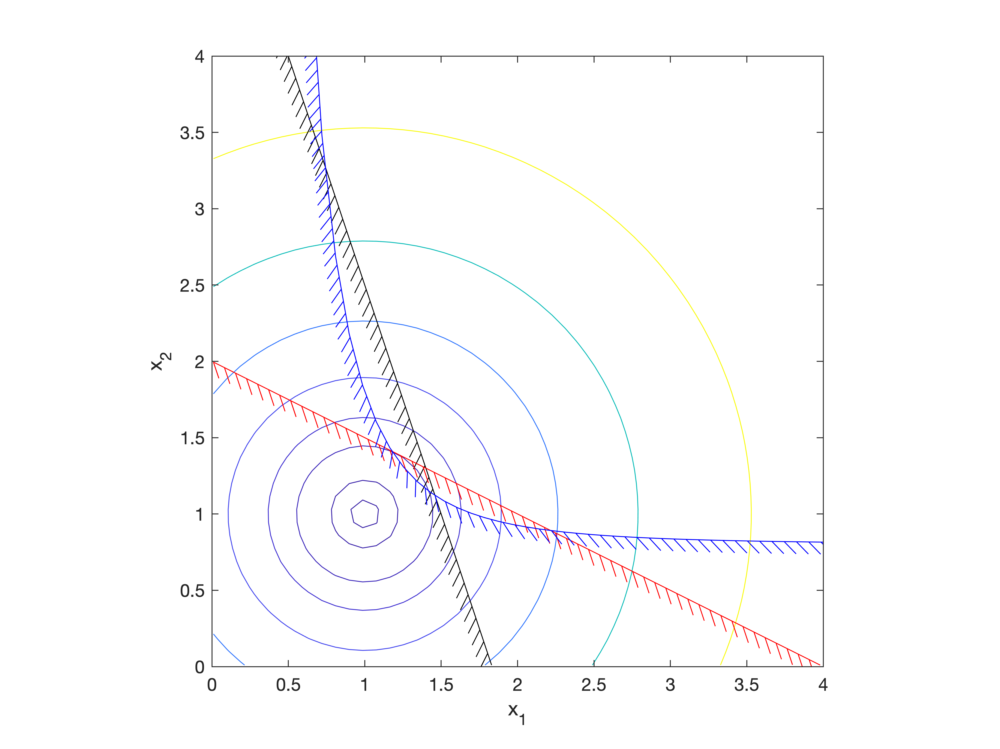

# Hatched Contours

Draw lines and contours with hatches on one side of the line in MATLAB.

These routines allow easy MATLAB plotting of lines or contours with hatches
on one side. This line style is often used in optimization problems to
represent a constraint, where one side of the line represents a no-go area.
The format (angle, length, spacing) of the hatches can be tailored.

This package is also available through the [Matlab File Exchange](https://www.mathworks.com/matlabcentral/fileexchange/29121-hatched-lines-and-contours).

## Included Functions

* hatchedline
   An extension of the **plot** command that draws with a hatched style.
* hatchedcontour
   Unwraps the contour **C** vector and draws then with a hatched style.
* ocontourc
   A replacement for **contourc** that guarantees contour orientation.

## License

This software is Copyright (c) Rob McDonald 2006-2021 and is released under the terms specified in the [license](license.txt).

