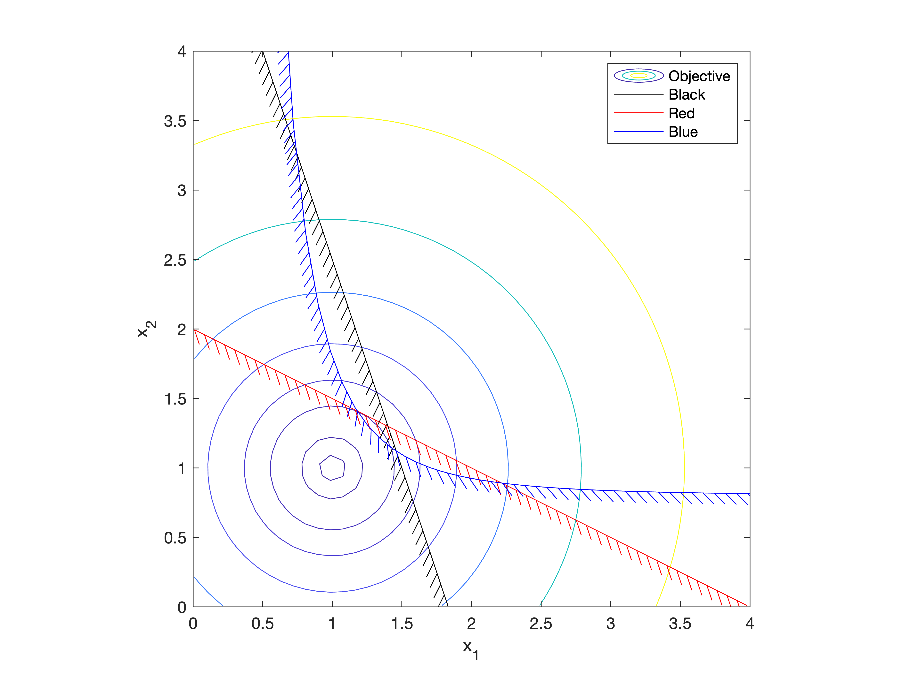

# Hatched Contours

Draw lines and contours with hatches on one side of the line in MATLAB.

These routines allow easy MATLAB plotting of lines or contours with hatches
on one side. This line style is often used in optimization problems to
represent a constraint, where one side of the line represents a no-go area.
The format (angle, length, spacing) of the hatches can be tailored.

This package is also available through the [Matlab File Exchange](https://www.mathworks.com/matlabcentral/fileexchange/29121-hatched-lines-and-contours).

## Included Functions

* hatchedline
   An extension of the **plot** command that draws with a hatched style.
* hatchedcontour
   Unwraps the contour **C** vector and draws then with a hatched style.
* ocontourc
   A replacement for **contourc** that guarantees contour orientation.

## Ports to Other Languages

My need to generate quality graphics representing constrained optimization problems
keeps coming back.  Each time in a different language.

In January 2006, I first needed to produce quality graphics in Java to represent a constrained
optimization problem.  To accomplish this, I implemented a custom Graphics2D Stroke that would draw hatches
along a line as the line itself was drawn.  Consequently, anything drawn with Java's
Graphics2D could use this custom line style.  I recently released the
[Java version](https://github.com/ramcdona/HatchedStroke).

Most recently (March 2019), my team once again needed to visualize constrained design
spaces; this time in Python and Matplotlib.  So, in a bit of déjà vu, I wrote the
same tool again.  This time I submitted it to the upstream project, and after
traversing their contribution process, it was accepted for inclusion in Matplotlib
version 3.4.0 -- first released in March 2021.

Similar to the Java approach, it is implemented as a PathEffect in Matplotlib and should
be applicable to any line drawn.  Update your Matplotlib to 3.4.0 or newer and you'll
have this capability.  Check out their example gallery for some documentation and examples
on using [TickedStroke](https://matplotlib.org/stable/gallery/images_contours_and_fields/contours_in_optimization_demo.html#sphx-glr-gallery-images-contours-and-fields-contours-in-optimization-demo-py).

## License

This software is Copyright (c) Rob McDonald 2006-2021 and is released under the terms specified in the [license](license.txt).

